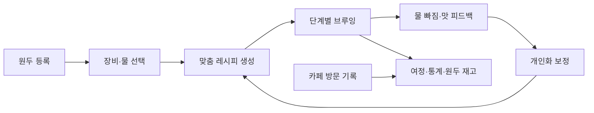
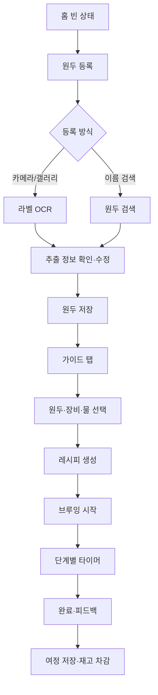

# Pourist 스크린샷 기반 앱 기획서

> 분석 대상: IMG_8914.PNG–IMG_8981.PNG, 총 67장  
> 문서 성격: 화면 역기획 + 신규 앱 구축용 PRD 초안  
> 주의: 화면에서 직접 확인한 내용은 **관찰**, 구현을 위해 보완한 내용은 **제안/추론**으로 작성했다.

## 1. 한 줄 정의

사용자가 보유한 원두와 추출 장비를 등록하면 맞춤 핸드드립 레시피를 생성하고, 단계별 타이머로 브루잉을 안내하며, 결과 피드백을 다음 레시피에 반영하는 **개인 커피 여정 기록 앱**이다.

## 2. 제품의 핵심 가치

이 앱은 단순한 커피 타이머가 아니다. 스크린샷 전체에서 확인되는 제품의 핵심은 다음 루프다.

1. 원두와 장비를 등록한다.
2. 현재 환경과 취향에 맞는 레시피를 추천받거나 직접 만든다.
3. 단계별 가이드에 맞춰 브루잉한다.
4. 물 빠짐과 맛을 평가한다.
5. 피드백을 다음 레시피에 반영한다.
6. 원두·장비·카페·브루잉 기록이 개인의 커피 여정으로 축적된다.

즉, 제품의 방어력은 레시피 자체보다 **사용자의 반복 기록과 피드백으로 개인화되는 데이터 루프**에 있다.

## 3. 타깃 사용자

### 핵심 사용자

- 집에서 핸드드립을 하지만 매번 맛이 달라지는 입문자·중급자
- 원두, 그라인더, 드리퍼, 필터, 물 조합을 체계적으로 기록하고 싶은 사용자
- 유튜브·카페·바리스타 레시피를 저장해 실제 브루잉 타이머로 쓰고 싶은 사용자

### 보조 사용자

- 여러 원두와 장비를 보유한 홈바리스타
- 카페에서 마신 커피와 원두 산지를 기록하는 커피 애호가
- 추후 B2B 확장 시 로스터리·카페·장비 브랜드

### 대표 JTBD

- “이 원두를 내 장비로 맛있게 내릴 수 있는 시작점을 빠르게 얻고 싶다.”
- “레시피를 보면서 별도 타이머를 조작하지 않고 한 화면에서 추출하고 싶다.”
- “지난번과 무엇이 달랐는지 기록하고 다음 잔을 개선하고 싶다.”
- “지금 마시는 원두의 신선도와 남은 양을 놓치지 않고 싶다.”

## 4. 정보 구조

하단 탭은 4개로 구성된다.

| 탭 | 역할 | 주요 화면 |
|---|---|---|
| 지도 | 필터커피 카페 탐색·저장·길찾기 | 지도, 검색, 저장 카페, 최근 본 카페 |
| 여정 | 모든 브루잉·카페 기록의 타임라인 | 전체/가이드/커스텀/카페 필터, 기록 상세 |
| 브루잉 홈 | 오늘 내릴 커피를 준비하고 시작하는 핵심 허브 | 원두 카드, 가이드/커스텀 선택, 최근 기록 |
| MY | 개인 자산과 설정 관리 | 통계, 내 원두, 내 장비, 레시피, 프로필, 설정, 구독 |

전역 기능은 알림, 원두 등록, 장비 등록, 레시피 생성, 브루잉 실행, 구독 전환이다.

## 5. 스크린샷에서 확인된 화면 체계

### A. 홈과 원두 등록 — IMG_8914–IMG_8922

**관찰**

- 홈은 원두 카드 캐러셀과 ‘가이드/커스텀’ 세그먼트로 구성된다.
- 원두가 없으면 큰 빈 카드에서 등록을 유도한다.
- 등록 방식은 카메라, 이름 검색, 갤러리다.
- 라벨 촬영 후 원두명을 추출하고, 검색·분석 로딩을 거쳐 입력 폼을 자동 완성한다.
- 원두 정보에는 로스팅 날짜, 총량/남은 양, 로스터, 홀빈/분쇄, 보관 용기, 이름, 테이스팅 노트, 원산지, 설명, 로스팅 레벨이 포함된다.
- 원산지는 국가·지역뿐 아니라 품종과 가공 방식까지 여러 개 연결할 수 있다.

**핵심 정책 제안**

- OCR 결과는 신뢰도와 함께 보여주고 사용자가 저장 전에 반드시 확인하게 한다.
- 총량과 남은 양은 `g` 단위로 저장하며 브루잉 완료 시 사용량만큼 자동 차감한다.
- 원두 상태는 `마시는 중 / 냉동 중 / 다 마신`으로 관리한다.
- 등록 시 필수값은 이름과 남은 양만 두고 나머지는 선택값으로 처리한다.
- 같은 원두를 재구매하면 기존 항목을 덮어쓰지 않고 새 로트로 등록한다.

### B. 커스텀 레시피와 장비 카탈로그 — IMG_8923–IMG_8934

**관찰**

- 커스텀 레시피는 HOT/ICE, 이름, 출처, 메모, 사진, 그라인더/분쇄도, 드리퍼, 원두량, 물양, 온도, 총 추출 시간, 다단계 스텝으로 구성된다.
- 그라인더·드리퍼·필터·물은 미리 구축된 카탈로그에서 검색해 내 장비로 추가한다.
- 검색 결과가 없으면 장비 등록 요청이 가능하다.
- 장비별 브랜드, 모델명, 재질·형상·방식·유속 같은 메타데이터가 있다.
- 선택한 장비는 체크 표시되고 이후 레시피 입력과 홈 선택기에 즉시 반영된다.

**레시피 스텝 모델 제안**

각 스텝은 아래 필드를 가진다.

- 순서
- 동작 유형: 푸어, 대기, 저어주기, 스월, 종료 등
- 표시 이름
- 시작 시점
- 지속 시간
- 이번 스텝 물양
- 누적 물양
- 색상/진동/음성 안내 유형
- 사용자 안내 문장

### C. 맞춤 레시피 생성 — IMG_8935–IMG_8942

**관찰**

- 가이드 레시피는 원두, 그라인더, 드리퍼, 필터, 물을 선택해야 시작할 수 있다.
- 생성 과정에서 날씨·환경, 로스팅 정도·산지, 장비, 추출 비율, 분쇄도, 온도·뜸들이기를 분석한다는 단계별 메시지를 노출한다.
- 결과 화면은 향미 설명, 원두량, 물양, 온도, 시간, 분쇄도, 장비와 전체 스텝을 제공한다.
- 일부 가이드 노트는 Plus 구독 기능으로 잠겨 있다.

**중요한 제품 판단**

생성 화면은 AI가 계산하는 인상을 주지만, MVP에서는 완전 생성형 모델보다 **검증된 베이스 레시피 + 규칙 기반 보정**이 더 안전하다.

- 기본 비율: 원두 종류·로스팅·추출량별 템플릿
- 분쇄도 보정: 그라인더의 절대 눈금과 내부 표준 입자 크기 매핑
- 온도 보정: 로스팅 정도와 목표 향미
- 물 보정: 경도 범위와 미네랄 특성
- 스텝 보정: 드리퍼 유속·필터 저항·원두 가스 상태
- 자연어 설명만 생성형 AI로 작성

이 방식은 결과 재현성, 비용, 디버깅 가능성에서 유리하다.

### D. 브루잉 실행과 피드백 — IMG_8943–IMG_8953

**관찰**

- 시작 전에 카운트다운이 있다.
- 브루잉은 전체 스텝 수, 진행 바, 현재 단계, 남은 시간, 안내 문장, 이번/누적 물양을 큰 글자로 표시한다.
- 푸어 단계와 대기 단계가 색상으로 구분된다.
- 일시정지, 다음 단계 건너뛰기, 완료 버튼이 있다.
- 완료 후 물 빠짐 속도와 맛 피드백을 수집한다.
- 피드백은 즉시 또는 식은 뒤 알림을 받고 입력할 수 있다.

**실행 엔진 요구사항**

- 화면 잠금 방지
- 백그라운드 전환 후 정확한 시간 복원
- 진동·사운드·음성 중 선택 가능한 단계 알림
- 일시정지, 재개, 이전/다음 스텝, 조기 종료
- 현재 스텝이 아닌 세션 시작 시각을 기준으로 시간 계산해 드리프트 방지
- 중단된 세션 복구
- Dynamic Type에서도 핵심 타이머가 잘리지 않도록 대응

**피드백 최소 스키마**

- 물 빠짐: 느림 / 적정 / 빠름
- 종합 점수: 1–10
- 향미 축: 산미, 단맛, 바디, 쓴맛 또는 `약함 / 적정 / 강함`
- 자유 메모
- 사진
- 다음 레시피 자동 보정 동의 여부

### E. 지도와 카페 기록 — IMG_8954–IMG_8960

**관찰**

- Apple 지도 기반으로 보이는 다크 지도를 사용한다.
- 카페 마커, 검색, 저장 카페, 최근 기록, 현재 위치 이동이 있다.
- 카페 카드에서 주소, 길찾기, 저장을 제공한다.
- 길찾기는 외부 지도 앱 딥링크로 연결된다.
- 검색은 카페명 또는 지역을 지원한다.

**스토어 업데이트 설명에서 확인된 확장 기능**

- 카페에서 마신 커피 사진을 추가하면 가까운 카페를 자동 연결한다.
- 방문 날짜, 원두, 장비, 만족도, 커핑/테이스팅 노트를 기록한다.
- 사용자가 선택한 카페 기록을 익명 공개할 수 있다.
- 홈 브루잉과 카페 음용 기록이 같은 여정 탭에 쌓인다.

### F. 여정 — IMG_8961–IMG_8964

**관찰**

- 전체, 가이드, 커스텀, 카페로 필터링한다.
- 카드에는 별점, 원두명, 장비 조합, 원두량, 물양, 온도, 시간, 스텝 수, 평가 점수가 표시된다.
- 새 카페 기록 CTA가 항상 노출된다.
- 빈 상태마다 해당 기록 생성 화면으로 연결되는 CTA가 있다.

**제안**

- ‘여정’을 단순 로그 목록이 아니라 비교 도구로 발전시킨다.
- 동일 원두끼리, 동일 레시피끼리 결과를 비교할 수 있어야 피드백 루프의 가치가 살아난다.

### G. MY, 통계, 자산, 설정, 구독 — IMG_8965–IMG_8979

**관찰**

- 프로필·설정·알림·브루잉 잔디·연속 기록·통계가 있다.
- 통계에는 활동일, 총 브루잉, 연속 기록, 원두 산지 세계 지도가 있다.
- 내 원두에는 `Pourist Value`라는 점수와 상태별 필터가 있다.
- 내 장비는 그라인더/드리퍼/필터/물로 구분되며 카테고리별 대표 장비를 지정한다.
- 가이드 레시피와 커스텀 레시피는 별도 목록이다.
- 설정에는 알림, 언어, 무드, 약관, 개인정보처리방침, 오픈소스 라이선스, 앱 버전이 있다.
- Plus 구독은 가이드 노트, 원두 피크타임, 무제한 레시피, 상세 기록을 제공하며 월간/연간 상품이 있다.

**관찰된 가격**

- 월간 ₩9,900
- 연간 ₩59,000

가격은 화면 캡처 시점의 값이므로 신규 앱에서는 별도 시장 검증과 스토어 국가별 가격 정책이 필요하다.

## 6. 핵심 사용자 플로우

### 플로우 1: 첫 원두 등록 후 가이드 브루잉

### 플로우 2: 사용자 레시피 저장 후 실행

1. 홈 커스텀 탭 또는 MY의 커스텀 레시피에서 새 레시피를 연다.
2. 기본값과 장비를 선택한다.
3. 하나 이상의 스텝을 추가한다.
4. 합계 검증 후 저장한다.
5. 홈에서 레시피와 원두를 선택하고 브루잉한다.
6. 완료 기록은 커스텀 유형으로 여정에 쌓인다.

### 플로우 3: 카페 기록

1. 지도에서 카페를 선택하거나 여정의 카페 기록 CTA를 누른다.
2. 위치 권한과 사진 메타데이터를 이용해 후보 카페를 추천한다.
3. 방문 날짜, 원두, 음료, 장비, 사진, 맛 평가를 입력한다.
4. 공개 범위를 `비공개 / 익명 공개` 중 선택한다.
5. 기록을 여정과 통계에 반영한다.

## 7. MVP 범위

### 반드시 포함 — P0

- 이메일/소셜 로그인, 비회원 로컬 시작
- 원두 수동 등록·수정·삭제·재고 상태 관리
- 내 장비 등록과 대표 장비 설정
- 장비 카탈로그 검색
- 검증된 가이드 레시피 추천
- 커스텀 레시피 CRUD와 스텝 편집
- 단계형 브루잉 타이머
- 브루잉 완료, 점수, 물 빠짐, 간단 맛 피드백
- 여정 목록과 가이드/커스텀 필터
- 원두 사용량 자동 차감
- 로컬 알림
- 데이터 동기화와 기본 설정

### 1차 확장 — P1

- 원두 라벨 OCR과 검색 자동 완성
- 피드백 기반 레시피 보정
- 카페 지도, 저장, 검색, 길찾기
- 카페 음용 기록과 사진
- 상세 통계, 연속 기록, 산지 지도
- Plus 구독과 기능 제한
- 다국어

### 이후 — P2

- 익명 공개 카페 기록과 커뮤니티 데이터
- 날씨·고도·습도 기반 환경 보정
- 레시피 공유 링크/QR
- Apple Watch·Live Activity·위젯
- Bluetooth 저울·스마트 주전자 연동
- 로스터리/브랜드 파트너 콘텐츠
- 사용자별 향미 선호 임베딩과 고급 추천

### MVP에서 제외를 권하는 항목

- 생성형 AI가 모든 추출 수치를 자유롭게 만드는 기능
- 처음부터 전 세계 카페·장비를 완벽히 커버하는 카탈로그
- 공개 피드와 팔로우 기능
- 복잡한 포인트 경제 시스템
- Android와 iOS 동시 네이티브 개발

## 8. 기능 요구사항

### 원두

- 한 사용자는 여러 원두 로트를 보유할 수 있다.
- 브루잉 완료 시 사용된 원두량을 자동 차감한다.
- 남은 양이 임계치 이하이면 알림을 예약한다.
- 로스팅일 기준 권장 피크 구간을 계산한다.
- 냉동 전환 시 피크타임 계산 규칙을 분리한다.
- 삭제 대신 기본은 보관 처리하여 과거 브루잉 기록의 참조를 유지한다.

### 장비

- 카테고리: 그라인더, 드리퍼, 필터, 물.
- 사용자는 카탈로그 장비를 내 장비로 복사해 보유한다.
- 목록에 없으면 사용자 정의 장비를 만들거나 등록 요청을 보낸다.
- 그라인더 분쇄도는 모델별 눈금과 내부 표준값을 함께 저장한다.
- 카테고리별 대표 장비는 홈 기본값으로 자동 선택한다.

### 레시피

- 가이드 레시피는 시스템 생성 버전과 생성 근거 버전을 저장한다.
- 커스텀 레시피는 사용자가 자유롭게 수정·복제·삭제할 수 있다.
- 모든 푸어 스텝의 물양 합계는 총 물양과 일치해야 한다.
- 모든 스텝의 시간 합계는 총 추출 시간과 일치하거나 자동 계산한다.
- 과거 브루잉 재현을 위해 실행 시점의 레시피 스냅샷을 세션에 보존한다.

### 브루잉

- 시작 카운트다운은 3초를 기본값으로 한다.
- 스텝 전환 시 햅틱과 선택적 사운드를 발생시킨다.
- 앱이 백그라운드로 가도 실제 종료 시각을 기준으로 복원한다.
- 완료 시 원두 차감, 여정 생성, 통계 증가를 하나의 트랜잭션으로 처리한다.
- 사용자가 중단한 세션은 완료 기록과 구분한다.

### 피드백과 개인화

- 첫 3회는 질문 수를 최소화하고, 반복 사용자에게 상세 피드백을 점진적으로 노출한다.
- 사용자가 자동 보정을 원하지 않으면 기록만 저장한다.
- 보정 전후 값을 설명할 수 있어야 한다. 예: “지난 잔이 빨리 빠져 분쇄도를 한 단계 곱게 조정했어요.”
- 단일 피드백으로 과도하게 바꾸지 않고 최근 여러 잔에 가중 평균을 적용한다.

## 9. 데이터 모델 초안

| 엔터티 | 핵심 필드 |
|---|---|
| User | id, locale, timezone, units, subscription_status, notification_prefs |
| BeanLot | id, user_id, name, roaster, roast_date, roast_level, initial_g, remaining_g, storage_type, state, image_url |
| BeanOrigin | bean_id, country, region, farm, variety, process, altitude |
| TastingNote | bean_id, note_id 또는 free_text |
| EquipmentCatalog | id, category, brand, model, metadata, verification_status |
| UserEquipment | id, user_id, catalog_id, custom_name, is_primary, custom_metadata |
| WaterProfile | hardness, alkalinity, mineral_profile, source |
| Recipe | id, owner_id, type, hot_ice, name, source, bean_params, equipment_ids, dose_g, water_ml, temp_c, total_sec, version |
| RecipeStep | recipe_id, order, action_type, name, start_sec, duration_sec, water_delta_ml, water_total_ml, instruction |
| BrewSession | id, user_id, bean_id, recipe_snapshot, started_at, completed_at, status, actual_values |
| BrewFeedback | session_id, drawdown, score, acidity, sweetness, body, bitterness, memo, photo_urls |
| Cafe | id, provider_place_id, name, lat, lng, address, verification_status |
| CafeVisit | id, user_id, cafe_id, visited_at, bean_info, drink, equipment, score, notes, visibility |
| Notification | id, user_id, type, scheduled_at, read_at, entity_ref |
| Subscription | user_id, provider, product_id, state, expires_at, original_transaction_id |

### 데이터 무결성 원칙

- 과거 세션은 원두나 레시피가 수정되어도 당시 값이 바뀌지 않도록 스냅샷을 보관한다.
- 단위는 저장 시 `g, ml, °C, sec`로 정규화하고 표시 단계에서 변환한다.
- 장비 카탈로그와 사용자의 보유 장비를 분리한다.
- 카페 공급자 ID와 내부 ID를 분리해 지도 사업자 교체에 대비한다.

## 10. 추천 기술 구조

### 빠른 MVP 권장안

- 앱: React Native + Expo + TypeScript
- 서버: Supabase Auth, Postgres, Storage, Edge Functions
- 상태: TanStack Query + Zustand
- 지도: iOS 우선이면 Apple MapKit, 크로스플랫폼이면 Google Maps 또는 Mapbox 검토
- OCR: iOS Vision / Google ML Kit의 온디바이스 OCR 후 서버 검색
- 결제: RevenueCat + App Store/Google Play IAP
- 알림: 로컬 알림 우선, 재고·구독 알림은 푸시 추가
- 분석: PostHog 또는 Firebase Analytics
- 오류 추적: Sentry

### 왜 이 구성이 적합한가

- 타이머, 카메라, 알림, 지도 등 네이티브 기능을 유지하면서 개발 속도를 확보할 수 있다.
- 관계형 데이터가 많아 문서형 DB보다 Postgres가 자연스럽다.
- 장비·레시피·브루잉 스텝·피드백 사이의 조인과 버전 관리가 중요하다.

### 오프라인 전략

브루잉 도중 네트워크가 끊겨도 핵심 기능은 동작해야 한다.

- 선택한 원두, 장비, 레시피 스냅샷을 로컬에 저장한다.
- 브루잉 이벤트를 로컬 이벤트 로그에 기록한다.
- 완료 후 서버와 재동기화한다.
- 동시 수정 충돌은 레시피는 버전 생성, 단순 설정은 최신 수정 우선으로 처리한다.

## 11. 추천 API 경계

- `POST /beans/recognize`: 이미지에서 후보 원두 정보 반환
- `GET /catalog/equipment`: 카테고리·검색어 기반 장비 조회
- `POST /user-equipment`: 내 장비 추가
- `POST /recipes/recommend`: 원두·장비·물·목표값으로 가이드 레시피 생성
- `POST /recipes`: 커스텀 레시피 저장
- `POST /brew-sessions`: 브루잉 세션 시작
- `PATCH /brew-sessions/{id}`: 중간 상태·완료 기록
- `POST /brew-sessions/{id}/feedback`: 결과 피드백 저장
- `GET /journeys`: 유형·날짜·원두 필터 기반 기록 조회
- `GET /cafes/nearby`: 지도 영역 기반 카페 조회
- `POST /cafe-visits`: 카페 기록 저장

실제 구현에서는 REST 대신 Supabase RPC/직접 쿼리를 섞을 수 있으나, 추천 엔진과 OCR은 별도 함수 경계를 유지하는 편이 좋다.

## 12. 레시피 추천 엔진 v1

### 입력

- 원두: 로스팅 날짜·레벨, 가공, 산지, 테이스팅 노트
- 장비: 그라인더·분쇄도 범위, 드리퍼 유속, 필터 저항
- 물: 경도와 알칼리도
- 목표: 추출량, HOT/ICE, 강조할 향미
- 사용자 이력: 물 빠짐, 점수, 맛 축 피드백

### 처리

1. 장비 조합과 용량에 맞는 베이스 템플릿 선택
2. 로스팅과 경과일로 온도·뜸 시간 조정
3. 드리퍼/필터 유속으로 분쇄도·푸어 횟수 조정
4. 물 특성으로 온도·비율의 보수적 보정
5. 최근 피드백으로 제한 범위 내 미세 조정
6. 모든 값의 안전 범위와 합계 검증
7. 사용자에게 변경 이유를 자연어로 설명

### 출력 제약

- 총 푸어 물양 = 목표 물양
- 총 스텝 시간 = 목표 추출 시간
- 각 장비의 허용 용량을 초과하지 않음
- 온도와 분쇄도는 사전 정의 범위 안에 있음
- 동일 입력·동일 추천 버전은 재현 가능해야 함

## 13. UX와 시각 시스템 분석

### 관찰된 방향

- 거의 검정에 가까운 매트 배경과 미세한 패턴
- 브라운/샌드 컬러를 주 CTA와 선택 상태에 사용
- 가이드는 보라, 커스텀은 핑크, 카페는 오렌지로 구분
- 브루잉 화면은 푸어를 블루, 대기를 앰버 계열로 구분
- 큰 라운드 카드와 플로팅 캡슐형 하단 탭
- 세리프 로고와 산세리프 본문 조합

### 개선 권장

- 일부 보조 텍스트의 명암 대비가 낮아 접근성 문제가 있다. WCAG AA 수준을 목표로 조정한다.
- 화면 전반의 패턴은 감성은 좋지만 긴 목록과 폼에서는 가독성을 떨어뜨릴 수 있어 밀도를 낮춘다.
- 비활성 버튼과 단순 보조 텍스트의 색이 유사하므로 상태 차이를 더 분명히 한다.
- 브루잉 중에는 장식보다 숫자·행동·진동 피드백을 최우선으로 한다.
- 원본 앱의 상표, 카피, 고유 그래픽을 그대로 복제하지 않고 신규 브랜드 시스템을 구축한다.

## 14. 알림 설계

| 알림 | 트리거 | 기본 동작 |
|---|---|---|
| 맛 피드백 | 브루잉 완료 후 5–10분 | 해당 세션 피드백 화면 열기 |
| 원두 부족 | 남은 양이 2회분 이하 | 해당 원두 상세 열기 |
| 피크타임 | 권장 음용 구간 시작 | 홈에서 원두와 추천 레시피 열기 |
| 냉동 전환 | 설정한 디개싱/보관 시점 | 원두 상태 변경 제안 |
| 연속 기록 | 하루 종료 전 미기록 | 홈 브루잉 시작 열기 |

알림은 첫 브루잉 완료 직후 필요한 이유를 설명한 뒤 요청한다. 앱 최초 실행과 동시에 권한을 묻지 않는다.

## 15. 구독 전략

### 무료

- 원두·장비 기본 관리
- 제한된 가이드 레시피
- 커스텀 레시피 소수 저장
- 브루잉 타이머와 기본 기록
- 기본 카페 지도

### Plus

- 무제한 레시피와 고급 가이드
- 추천 근거와 추출 진단 노트
- 원두 피크타임·재고 예측
- 세부 피드백 기반 자동 보정
- 고급 통계와 비교
- 데이터 내보내기

### 전환 원칙

- 사용자가 첫 성공 경험을 얻기 전에 결제를 강제하지 않는다.
- 가장 좋은 전환 시점은 `두 번째 가이드 생성`, `상세 보정 이유 열람`, `저장 한도 도달`이다.
- 기능을 숨기기보다 미리보기와 구체적 효용을 보여준다.

## 16. 주요 지표

### 북극성 지표

**주간 피드백 완료 브루잉 수**  
단순 앱 실행이나 타이머 시작보다 ‘브루잉 완료 + 피드백’이 개인화 루프와 장기 가치에 직접 연결된다.

### 퍼널

- 가입 → 첫 원두 등록률
- 첫 원두 등록 → 첫 레시피 생성률
- 레시피 생성 → 브루잉 시작률
- 브루잉 시작 → 완료율
- 완료 → 피드백 입력률
- 7일 내 두 번째 브루잉률
- 무료 → Plus 체험 및 결제 전환율

### 품질 지표

- 타이머 세션 크래시율
- 레시피 생성 실패율
- OCR 필드별 수정률
- 추천 레시피 평균 점수
- 자동 보정 후 점수 개선률
- 원두 재고 오차 신고율

## 17. 이벤트 분석 설계

- `bean_add_started`, `bean_add_completed`, `bean_ocr_corrected`
- `equipment_searched`, `equipment_added`, `equipment_request_submitted`
- `recipe_recommend_started`, `recipe_recommend_completed`, `recipe_saved`
- `brew_started`, `brew_paused`, `brew_step_skipped`, `brew_completed`, `brew_abandoned`
- `feedback_submitted`, `feedback_deferred`
- `cafe_viewed`, `cafe_saved`, `directions_opened`, `cafe_visit_logged`
- `paywall_viewed`, `trial_started`, `subscription_started`, `subscription_cancelled`

모든 이벤트에는 앱 버전, 레시피 유형, 장비 조합, 온라인/오프라인 상태를 가능한 범위에서 포함하되, 공개 카페 기록 외의 민감한 개인 메모는 분석 이벤트로 보내지 않는다.

## 18. 예외·실패 상태

- 카메라/사진 권한 거부 → 이름 검색과 수동 입력 제공
- OCR 결과 없음 → 원본 사진을 유지하고 빈 폼 제공
- 장비 검색 결과 없음 → 사용자 정의 등록 + 관리자 검수 요청
- 위치 권한 거부 → 지역 검색 중심 지도 제공
- 레시피 생성 실패 → 안전한 기본 템플릿과 재시도 제공
- 브루잉 중 앱 종료 → 마지막 세션 복구 또는 폐기 선택
- 원두 잔량 부족 → 실제 사용량 수정 또는 다른 원두 선택
- 결제 검증 실패 → 기능 즉시 박탈보다 영수증 재검증 유예
- 동기화 충돌 → 과거 로그는 병합, 레시피는 새 버전 생성

## 19. 보안·개인정보·운영

- 카페 방문 기록은 기본 비공개로 설정한다.
- 사진 EXIF 위치는 명시적 동의 없이 장기 보관하지 않는다.
- 계정 탈퇴 시 개인 데이터 삭제와 공개 기록 익명화 정책을 분리해 고지한다.
- 결제 상태는 클라이언트 플래그가 아니라 스토어 영수증/서버 웹훅을 기준으로 한다.
- 장비·카페·원두 카탈로그는 관리자 검수 상태를 가진다.
- AI/OCR에 전송되는 이미지와 텍스트의 보존 기간을 고지한다.

## 20. 개발 로드맵 예시

### 0단계 — 1주

- 브랜드와 제품 범위 확정
- 핵심 데이터 모델·디자인 토큰·분석 이벤트 정의
- 베이스 레시피 10–20개와 추천 규칙 검증

### 1단계 — 3주

- 인증, 홈 셸, 내 원두, 내 장비
- 장비 카탈로그와 대표 장비
- 로컬/서버 동기화 기반

### 2단계 — 3주

- 가이드 추천 v1
- 커스텀 레시피 편집기
- 브루잉 타이머와 백그라운드 복원

### 3단계 — 2주

- 완료 피드백, 여정, 재고 자동 차감
- 알림, 기본 통계, 설정

### 4단계 — 2주

- 구독, 분석, 오류 추적
- 접근성·오프라인·복구·스토어 심사 준비

### 5단계 — 출시 후

- OCR, 카페 지도, 고급 개인화 순으로 확장

소규모 2–3인 팀 기준 약 10–12주의 iOS 우선 MVP를 예상할 수 있다. 외부 카탈로그 구축과 추천 규칙 검증의 범위에 따라 일정은 크게 달라진다.

## 21. QA 핵심 시나리오

1. 원두 20g 남은 상태에서 20g 브루잉 완료 시 `다 마신`으로 정확히 이동한다.
2. 브루잉 중 앱을 40초 백그라운드로 보낸 뒤 복귀해도 현재 스텝과 남은 시간이 정확하다.
3. 일시정지 상태에서는 시스템 시간이 지나도 타이머가 줄지 않는다.
4. 푸어 합계가 총 물양과 다르면 레시피 저장을 막거나 자동 보정한다.
5. 원두·레시피를 수정한 뒤에도 과거 여정은 당시 값으로 보인다.
6. 오프라인 완료 세션이 재연결 후 한 번만 동기화된다.
7. 위치·사진·알림 권한을 모두 거절해도 핵심 브루잉 기능을 쓸 수 있다.
8. Dynamic Type 최대 단계와 VoiceOver에서 브루잉 조작이 가능하다.
9. 결제 취소·환불·갱신 실패 후 권한 상태가 서버와 일치한다.
10. 사용자가 앱 종료 후 다시 열었을 때 중단 세션을 복구하거나 폐기할 수 있다.

## 22. 우선 결정해야 할 제품 질문

개발 착수 전에 아래 항목을 확정하면 재작업을 크게 줄일 수 있다.

1. 신규 앱의 차별점은 `개인화 레시피`, `브루잉 UX`, `커피 기록/카페` 중 무엇인가?
2. 첫 출시 플랫폼은 iOS 단독인가, iOS·Android 동시인가?
3. 가이드 레시피의 책임 주체는 전문가 큐레이션인가, 알고리즘인가?
4. 장비 카탈로그를 누가 만들고 검수하는가?
5. 카페 지도는 MVP 매력 기능인가, 출시 후 확장 기능인가?
6. 무료 사용자가 반복 가치를 경험할 수 있는 레시피 한도는 몇 개인가?
7. 사용자의 상세 원두·맛 기록을 추천 학습에 활용할 것인가?
8. 한국 시장 우선인지 글로벌 출시인지에 따라 물·카페·장비 데이터 전략을 어떻게 나눌 것인가?

## 23. 최종 제안

가장 설득력 있는 첫 버전은 **“내 원두와 장비에 맞는 레시피를 만들고, 타이머로 내리고, 한 번의 피드백으로 다음 잔을 개선하는 앱”**이다.

지도, 세계 통계, 공개 카페 기록은 매력적이지만 초기 제품의 핵심 검증을 분산시킬 수 있다. 먼저 아래 루프가 반복되는지를 검증하는 것이 좋다.

`원두 등록 → 추천 → 브루잉 → 피드백 → 개선된 재브루잉`

이 루프의 7일 재사용률이 확인된 뒤 OCR, 카페 지도, 구독 고도화를 붙이면 제품의 중심이 흔들리지 않는다.
